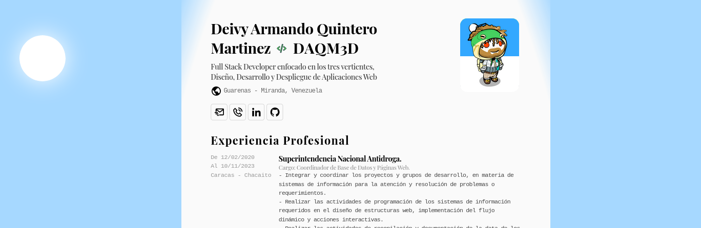

# CurriFolio Minimalista<picture><source media="(prefers-color-scheme: dark)" srcset="./public/Briefcase.webp"><source media="(prefers-color-scheme: light)" srcset="./public/Briefcase.webp"></picture>

Aplicación que permite tener un **Currículo - Portafolio** minimalista, el cual cuenta con la siguiente estructura: Experiencia Profesional, Conocimientos, Cursos, Estudios, Referencias. Además, **este cuenta con las siguientes características:**

- [x] Modo responsivo.
- [x] Tema de modo Light y Dark.
- [x] Menú de acciones con el comando **Cmd + K**.
- [x] Funcionalidad de Imprimir o Guardado en PDF.
- [ ] Minijuego de búsqueda.
- [ ] Permite editar los estilos de colores y las fuentes como te plazca.
- [ ] Data configurable vía archivo de carga JSON.

Modifica los estilos y las fuentes a tu conveniencia, una vez termines edita la plantilla de archivo `cv.json` y cárgalo para crear tu propio CurriFolio imprimible

##  Lenguajes y Framework Usadas

- HTML5
- CSS
- JavasScript

##  Herramientas y Tecnologías Usados

- Astro
- Docker
- Git

##  Conocimientos Adquiridos

- Creación de aplicaciones en [Astro](https://astro.build/)
- Uso de librería [ninja-Keys](https://github.com/ssleptsov/ninja-keys)
- Uso de propiedad css display [unset](https://dev.to/lupitacode/palabras-clave-en-css-initial-inherit-unset-y-revert-11ob)

##  Referencia

- Convención de la estructura de datos a usar inspirada en [JSON](https://jsonresume.org/schema/).
- Video de inspiración portfolio minimalista de [Midudev](https://www.youtube.com/watch?v=Zwh92LTB-Bk).
- Videos de inspiración de [Animaciones](https://www.youtube.com/@OnlineTutorialsYT).
- Emojis animados de [Animated TeleEmojis](https://telegram-animated-emojis.vercel.app/).
